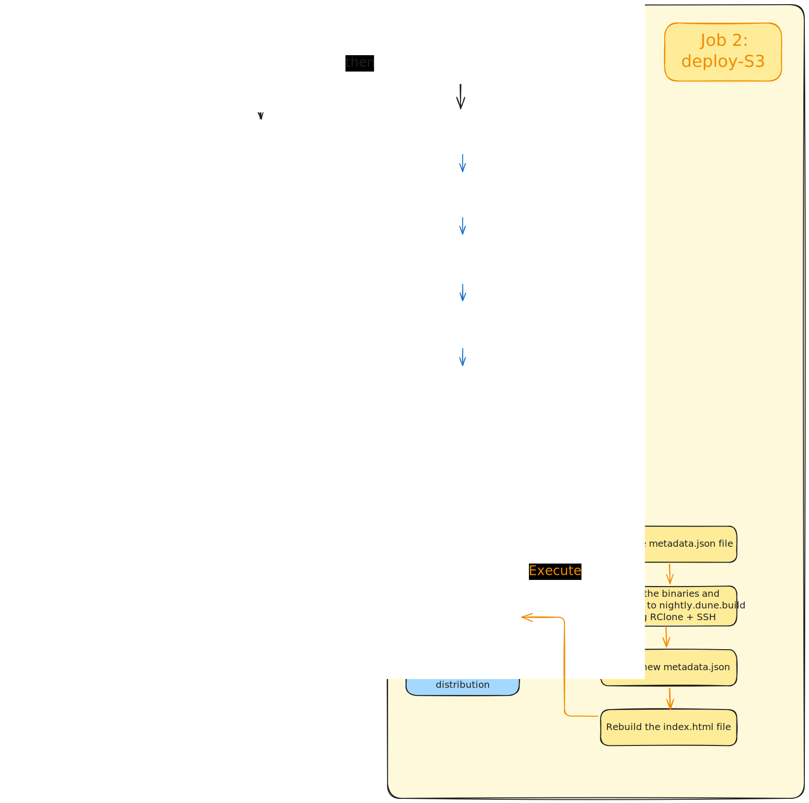

# Dune binaries distribution

This is the web site for for the nightly binary distribution of  `dune`. The
page is automatically generated from file `metadata.json`. Apart from the
_YAML_ part, the code is written in _OCaml_.

The GitHub Actions pipeline regularly creates commit on the `main` branch where
it:
- updates the content of `metadata.json`
- generates new artifacts and pushes them to their SSH storage using `RClone`
- publishes the Dockerfile used to deploy the website

The web page is deployed on [nightly.dune.build](https://nightly.dune.build).

> :hourglass: The pipeline is triggered every day at _01:00 UTC_.

> [!CAUTION]
> The _metadata.json_ file must not be modified manually. If you do so, expect some unexpected behaviours.


## Installation & configuration

### Requirement

You need to have `dune` available to install and build the project. A
relatively recent version with package management support like 3.20 or newer is
preferable.

### Building

The repository comes with a lock directory in `dune.lock`, thus the
dependencies will be automatically downloaded and built when running `dune
build`.

### Configure

The configuration is in [bin/config.ml](./bin/config.ml)
file. When running in the pipeline, the _sandworm_ binary is generated before
its execution. As a result, the path taken is the root of this repository. If
you want to run it locally, make sure the _files artifacts_ and `rclone.conf`
are available in the directory where _sandworm_ binary is executed.

The export relies on an SSH key to the server. If you want to run your own
tests, you need to have a server available by _SSH_ with an _SSH key_. Then,
you have to create a `rclone.conf` file as follows:

```toml
[dune-binary-distribution]
type = sftp
user = <username>
host = <replace.myhost.com>
key_file = </path/to/your/ssh/private/key>
shell_type = unix
```

If you don't have a `/dune` directory on your server, you might want to change
the `s3_bucket_ref` variable. It could be:

```ocaml
let s3_bucket_ref = "dune-binary-distribution:/path/to/your/server/dir"
```

> [!TIP]
> For our use case, the _RClone_ configuration works with SFTP but, it is
> compatible with any _RClone_ provider.

## Running

Now your setup is ready, you can execute this list of commands to generate or
update the files:

```sh
$ ls
artifacts rclone.conf
$ dune exec -- sandworm sync --commit [commit hash]
```

## Running the development server

To make the development of the web pages easier, you can use the web server in
development mode. It will auto update the page will saving files and
regenarate the CSS if needed:

```sh
$ dune exec --watch sandworm -- serve --dev
```

You can then go to [http://localhost:8080/](http://localhost:8080) and see the
website.

The flag `--dev` has two actions. To protect the users, it only exposes the
server to `localhost` instead of `0.0.0.0`. Also, it injects a script in the
page to ensure the page is reloaded when you restart the server.

## Deploying

### Deploying on staging environment

If you need to test your work, you can push on the staging environment. This
environment is available at https://staging-nightly.dune.build. If you just need
to test the website view, you need to reset the HEAD of the `staging` branch
and push force on it:
```sh
 $ git switch staging
 $ git reset --hard <mybranch>
 $ git push origin staging --force-with-lease # Ensure nobody is not testing in the same time
```
If you want to test this installation script, go to the ["binaries"
actions](https://github.com/ocaml-dune/binary-distribution/actions/workflows/binary.yaml)
page and run the `Run workflow` on the `staging` branch. 

### Deploying in production

The deployment are automatically done through GitHub Actions. No need to add
extra work to deploy it.

## Understand the pipeline

This schema provides explanations about the workflow used to build the binaries
and the certificates, and export them to the correct server.


## User flow

The nightly binary distribution consists of multiple parts:

  1. The GitHub Action `binaries` which spins up GitHub runners, builds Dune on
     them, verifies the attestation. The tarballs are then uploaded to date-keyed
     subfolders on `get.dune.build`, along with the `install` script. Then the
     action updates the repository with a new entry into `metadata.json`.

     This action is run nightly if there are changes on the Dune repository. If
     no changes happened (weekends) it will skip the run and no new binaries
     will be uploaded.
  2. `get.dune.build` is a server hosting static files, uploaded via RClone
     using SFTP as part of the GitHub action. Users eventually download the
     tarballs from this location.
  3. The web server (`sandworm serve`) running on `nightly.dune.build`. It
     serves the [web site](https://nightly.dune.build), the install script, and
     the endpoint used by the install script to get redirected to the most
     recent binary for a certain target. This is done by reading the
     `metadata.json` file.

     This web server is built and deployed via the `Dockerfile` on
     `nightly.dune.build`.

This setup has certain advantages, like the fact that users of the installer
will automatically get the most recent version of the binary, without having to
update the install script every time there is a new release. It also means that
the binaries could be served via a CDN, as `get.dune.build` is exclusively
serving static content that can be served efficiently.

One downside of this setup is that the install script on
`nightly.dune.build/install` is updated as soon as the `main` branch is
deployed, however the install script at `get.dune.build/insall` is only updated
once the `binaries` action is run. Which can take several days if no changes
are happening in the Dune repository.
